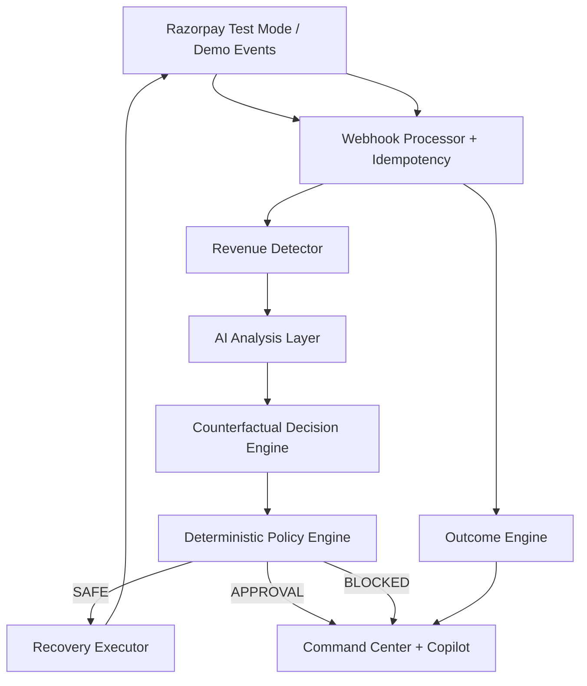
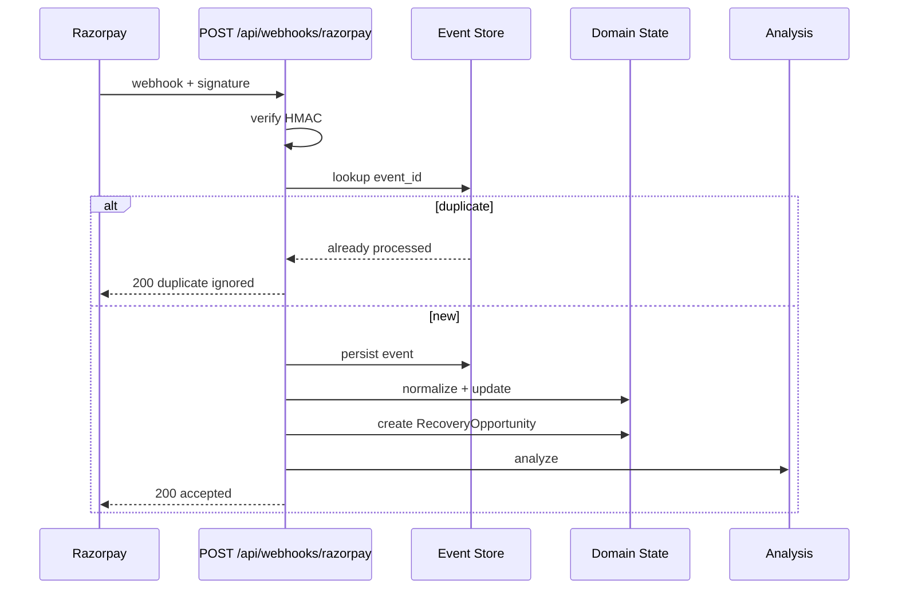
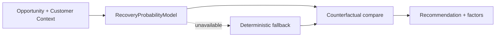
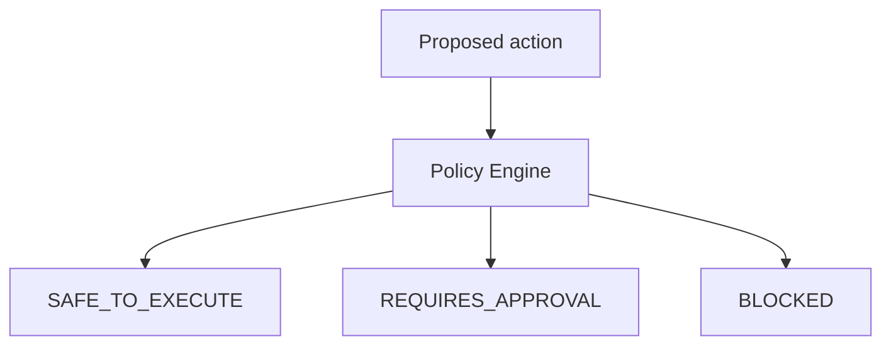
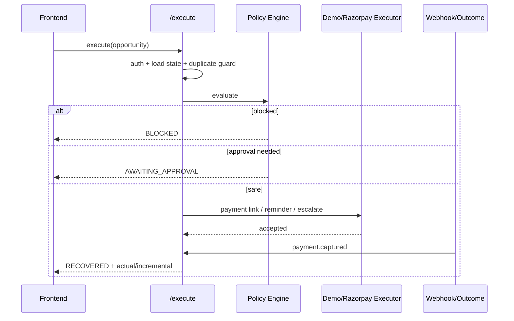
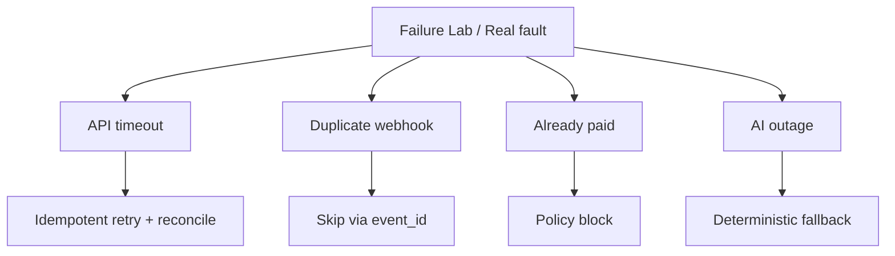
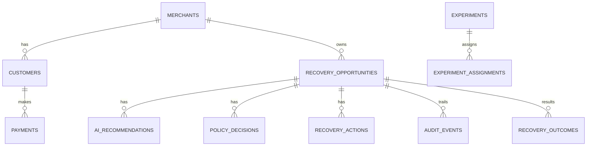
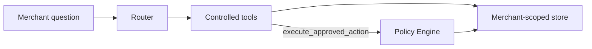

# REVORA Architecture

## System overview

## Webhook flow

## AI decision flow

AI may recommend. AI may not approve unsafe money movement.

## Policy flow

Checks include: already-paid, retry limits, cooldown, auto-amount, confidence, high-risk approval, reminder frequency.

## Execution flow

## Failure recovery

## Data model (core)

Amounts are stored in **paise** (Razorpay convention).

## Copilot architecture

Tools validate input, scope to merchant, audit calls, and never bypass policy for execution.

## Module map

| Path | Responsibility |
|---|---|
| `src/lib/recovery/` | Probability, counterfactual, executor, webhooks |
| `src/lib/policy/` | Deterministic safety |
| `src/lib/razorpay/` | Official API client wrappers |
| `src/lib/copilot/` | Tool-constrained ops interface |
| `src/lib/reliability/` | Failure Lab simulations |
| `src/lib/analytics/` | Metrics, lift, health |
| `src/lib/store/` | Demo seed + memory store |
| `supabase/migrations/` | Postgres + RLS |
